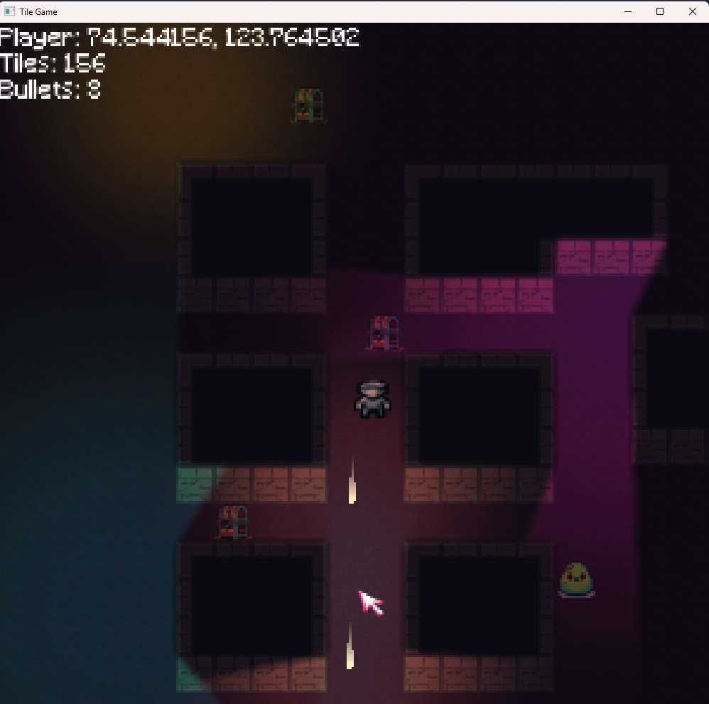

# Tile-engine

SFML based tile engine with support for dynamic ray casted lights

## Usage Instructions

### Prerequisites
- CMake (Minimum version 3.10)
- A C++17 compatible compiler

### Building the Project

On Windows run build.bat
On Linux or MacOS run build.sh